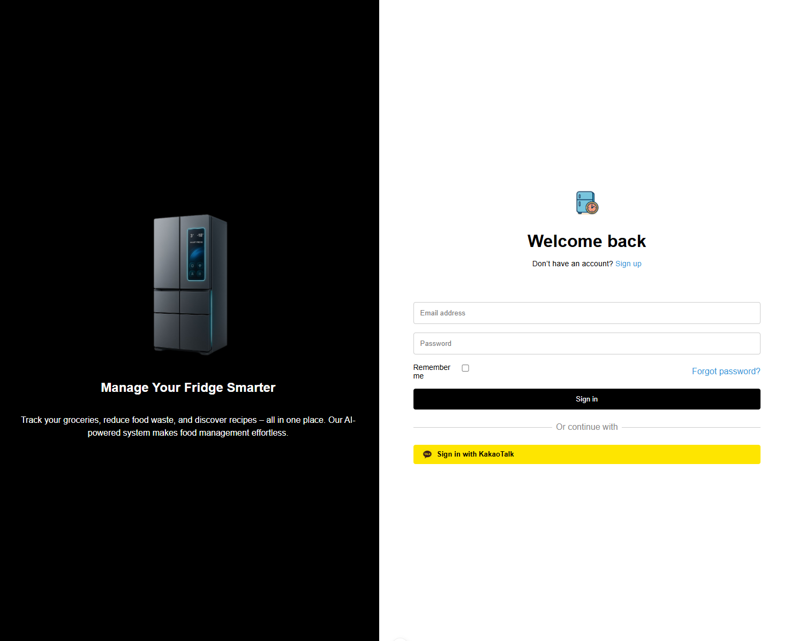
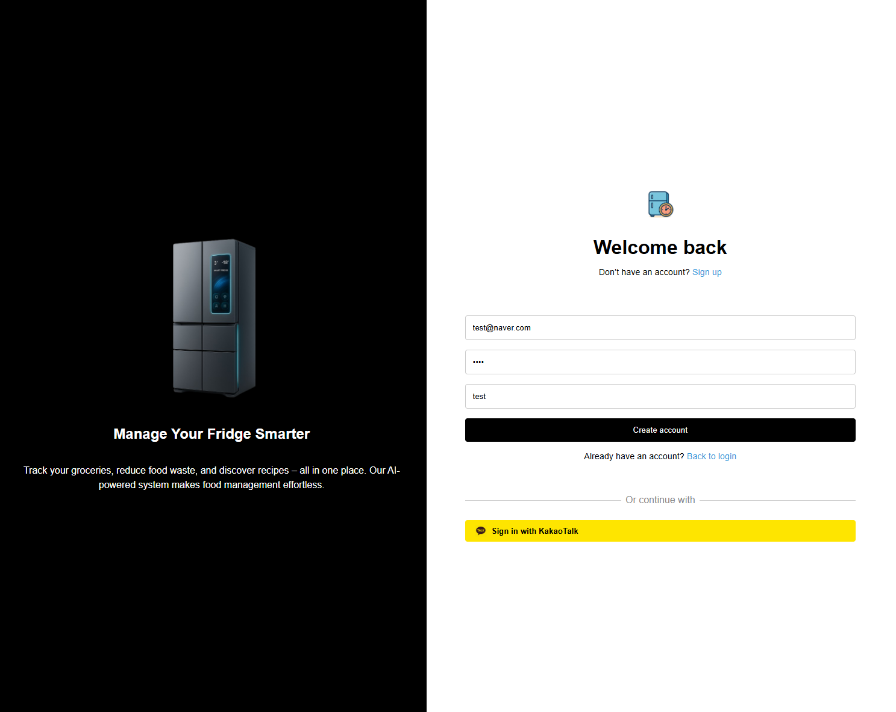
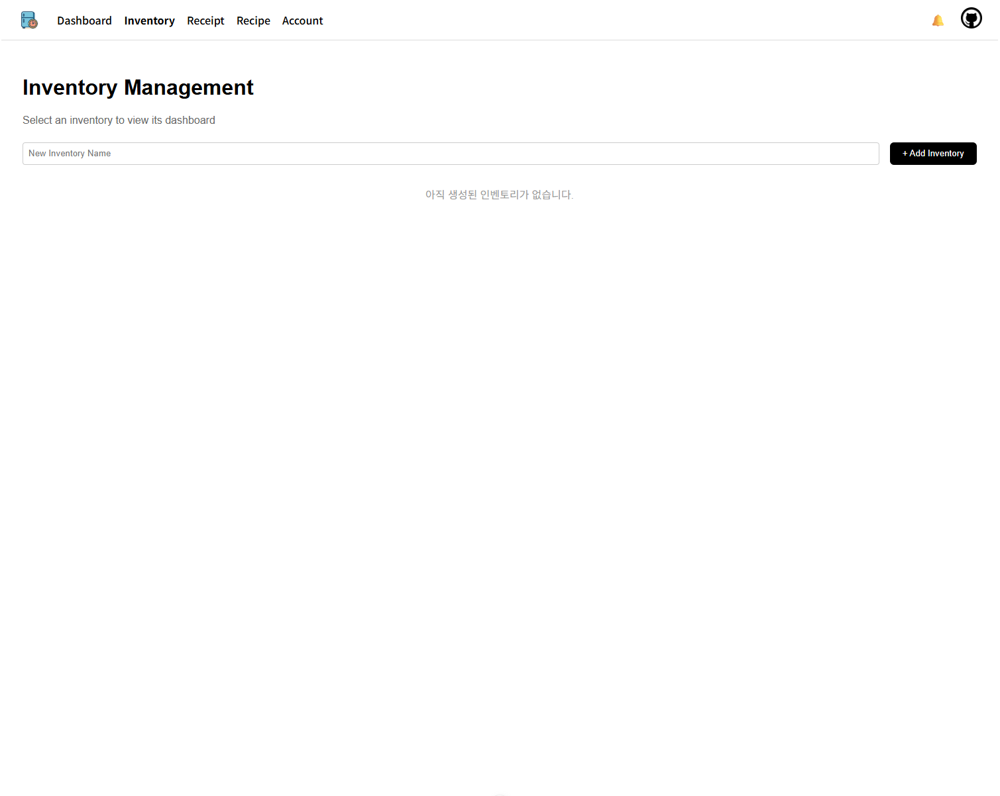
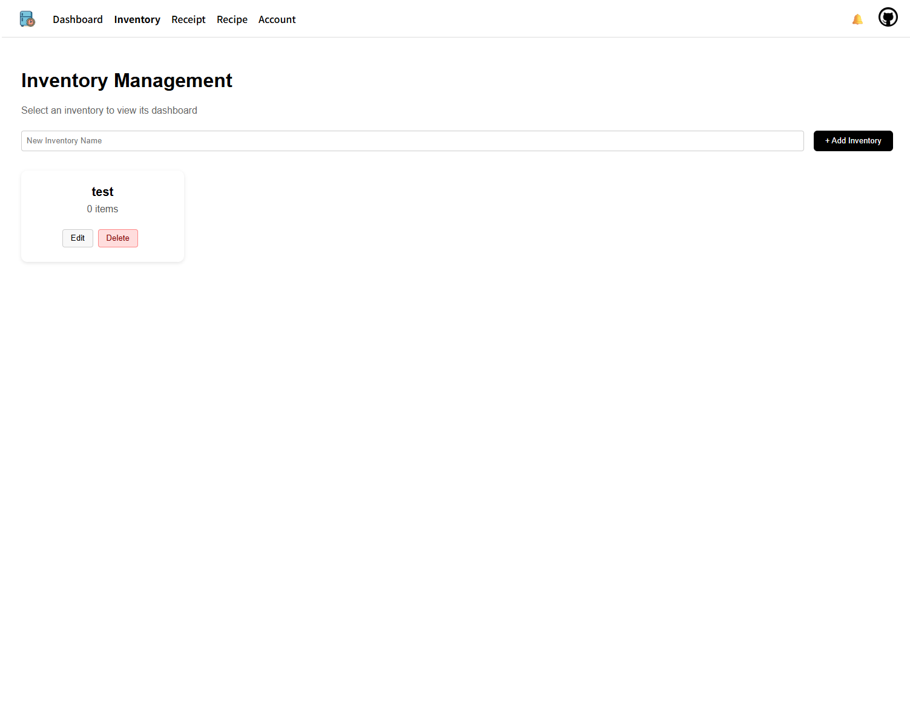
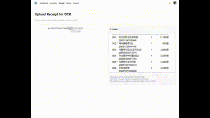

# 🧊 냉장고 재고 관리 시스템 - 사용자 가이드

## 🔍  개요
이 프로젝트는 냉장고에 있는 재고를 관리하고, 유통기한 임박 항목을 알려줍니다. 주 기능으로는 OCR을 통해 사용자가 영수증 사진을 업로드하면 물품 등록 단계에서 자동 입력되며, 자신의 재고 리스트를 확인하고 해당 리스트를 기반으로 레시피를 제안 받을 수 있습니다.

## 🛠 제공 기능 요약

- **🔎 냉장고 선택 및 대시보드 시각화**
  - 사용자가 보유한 인벤토리(냉장고) 목록을 드롭다운으로 선택
  - 선택한 인벤토리에 따라 자동으로 식재료 카드 및 레시피 추천, 도넛 그래프 갱신

- **⏰ 유통기한 임박 재료 알림**
  - 유통기한이 5일 이내인 항목 자동 필터링하여 “Items Expiring Soon” 카드에 표시

- **📦 재고 부족 재료 알림**
  - 수량이 2 이하인 재료를 “Low Stock Items” 카드에 표시

- **📊 식재료 시각화**
  - 냉장/냉동 항목을 분리하여 도넛 그래프로 시각화
  - 각 항목마다 **랜덤한 고유 색상**을 지정하고, 이후에도 고정되도록 구현

- **📋 식재료 직접 추가 및 관리**
  - Add Item 폼을 통해 직접 입력 가능
  - Edit Items 버튼을 통해 재고 수정 및 삭제 가능

- **📸 OCR 영수증 인식**
  - 영수증 이미지 업로드 → OCR로 자동 항목 추출 및 추가

- **🍽 레시피 추천**
  - 현재 재고 기반으로 GPT가 생성 가능한 레시피 추천
  
---

## 💻 설치 및 실행 (Local Window 기준)

> ⚠ 백엔드 서버는 Spring Boot / 프론트엔드는 Vue.js 기반입니다.

## 1. 프로젝트를 저장시킬 폴더 만들고 폴더로 이동 (windows git bash 환경 기준)
cd c:/프로젝트 폴더

## 2. 프로젝트 clone(다운 받기)
git clone 경진님 깃헙 주소

## 3. 프로젝트 환경 설치
- Node.js 18 이상 (프론트엔드 실행용)
- Java 17 이상 (Spring Boot 백엔드)
- MySQL 8.0 이상
- Git

## 🧩 프론트엔드 실행
cd 프론트 폴더
npm install
npm run dev

// 백엔드는 잘 모르겠어요..ㅜㅜ

## ✨ 기능 동작 예시

### 로그인 / 회원가입

<table>
  <tr>
    <td></td>
    <td></td>
  </tr>
  <tr>
    <td align="center">1. 로그인 페이지</td>
    <td align="center">2. 회원가입</td>
  </tr>
</table>

---

### 인벤토리 관리

<table>
  <tr>
    <td></td>
    <td></td>
  </tr>
  <tr>
    <td align="center">3. 인벤토리 초기화면</td>
    <td align="center">4. 인벤토리 생성 후(물품 추가 전)</td>
  </tr>
</table>

---

### 영수증 입력

<table>
  <tr>
    <td></td>
  </tr>
  </table>

---

